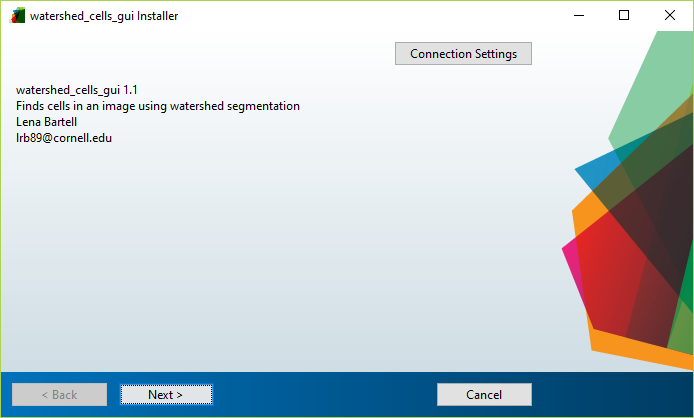

# Quick Start Guide for Watershed Cells GUI
Lena Bartell

## Table of contents

* [Table of contents](#table-of-contents)
* [Installation](#installation)
    * [Download the GUI files](#download-the-gui-files)
    * [Add the GUI folder to your MATLAB path](#add-the-gui-folder-to-your-matlab-path)
    * [Check your MATLAB version](#check-your-matlab-version)
* [Basic usage](#basic-usage)
    * [Start the GUI](#start-the-gui)
    * [Set parameters](#set-parameters)
    * [Image analysis process](#image-analysis-process)
    * [Display the result](#display-the-result)
    * [Save the result](#save-the-result)
* [More information](#save-the-result)
    * [Algorithm details](#algorithm-details)
    * [Feedback](#feedback)


## Installation

### Download the GUI files

Download the GUI (graphical user interface) files to a folder and save it somewhere. The folder should contain the following files:

```
watershed_cells_gui.m
watershed_cells_gui.fig
private\marker_watershed.m
private\find_cells.m
```

You may also want to include the provided example image, `test.tiff`.

### Add the GUI folder to your MATLAB path

In MATLAB, go to the HOME tab and, in the ENVIRONMENT section, click “Set Path”. In the window that opens, click “Add Folder…” and add the folder containing the GUI files to your path.


_Figure 1. MATLAB window highlighting Set Path (red arrow) and current folder (blue arrow)._

### Check your MATLAB version

This GUI will only work on MATLAB R2014b or later and requires the Image Processing Toolbox. To check your version of MATLAB, enter `ver` into the Command Window. You should get something that looks like this:

```
>> ver
-----------------------------------------------------------------------
MATLAB Version: 9.0.0.341360 (R2016a)
...
-----------------------------------------------------------------------
MATLAB                                    Version 9.0         (R2016a)
Image Processing Toolbox                  Version 9.4         (R2016a)
...
```

Note: This GUI has only been tested on Windows machines. I have no expectation that it will work on other operating systems.


## Basic usage

### Start the GUI

To start the watershed cells GUI, run:

```
>> figure_handle = watershed_cells_gui
```

This will open the watershed cells GUI in a window. It should look like this:



_Figure 2. watershed_cell_gui initial appearance_

### Set parameters

In the GUI, set the parameters by editing the text boxes. To skip a particular step in the analysis, un-check the tick box next to the associated parameter. In general, you will need a lot of trial-and-error to pick the best parameters for your image. However, there are some rough guidelines below.
The parameters (and guidelines) are:

- *Path to image*: The path to the image file, including name and extension. If only a partial path is provided (i.e. no drive letter or folders, as Fig. 2), make sure the image file is in your current folder or MATLAB’s path (see Fig. 1). If the path is invalid, the program will pop-up with a dialog box and ask you to select the file. 
- *Equalization clip limit*: The “Clip Limit” parameter passed to the adaptive histogram equalization filter. This is a number between 0 and 1, but values around 0.01 are usually best. See MATLAB’s function adapthiseq for more information.
- *Background size*: Background subtraction is performed using a median filter of this size (units: pixels). This should be an odd positive integer that is much larger that the diameter of your cells/objects. Background subtraction is usually the slowest step in the process, so skip it if you don’t need it. Generally, background subtraction important for epi-fluorescence images (due to unwanted out-of-focus/background signal), but optional for confocal images (because the confocal pinhole already blocks much of this background).
- *Median size*: The size of a separate median filter used for smoothing / reducing noise (units: pixels). This should be roughly the same size or smaller than the cells you are trying to find.
- *Gaussian radius*: The radius of a Gaussian filter also used for smoothing / reducing noise (units: pixels). If the signal is discontinuous across an individual cell (e.g. if staining individual organelles), this radius should be approximately the radius of a cell. If the signal is relatively continuous across the cell (e.g. standard live/dead staining assay), this can be smaller. Values smaller than 0.5 px are not recommended. 
- *Minimum area*: After finding objects/cells, discard any objects that have fewer than this many pixels in their area (units: pixels). This should be approximately r2, where r is the average cell radius in pixels.
- *Maximum area*: Also discard any objects that have more than this many pixels in their area. This should be approximately (2r)2 to (5r)2, where r is the average cell radius in pixels.
- *Minimum signal*: Also discard any objects that have an average signal-intensity smaller than this value (units: fraction of intensity range). This value is expressed as a fraction of the full range of possible intensities, so it should be a number between 0 and 1 (rather than 0 and 255, for example). This value will vary drastically based on imaging settings, image quality, other parameter values, and your desired output, so I won’t provide any guidelines.

### Image analysis process

Once parameters are set, click “Find Cells” to run the image analysis process and display the result. Briefly, the image analysis procedure is:

1. Pre-processing
  1. Import image 
  2. Adaptive histogram equalization
  3. Background subtraction using a median filter (using "background size" parameter)
  4. Median filter to smooth
  5. Gaussian filter to remove noise
2. Watershed segmentation
  1. Determine background using a conservative Otsu's threshold
  2. Watershed segmentation, with background enforced
3. Post-processing
  1. Remove cells that are too small 
  2. Remove cells that are too big 
  3. Remove cells that are too dim 

### Display the result

Once the image analysis process is complete, the result will display on the right side of the window. The display includes the raw image. On top of the raw image is a second image showing just the outlines of the cells that were segmented. The “Cell outline alpha” value controls how bright these boundaries appear; 0 means they are not visible, 1 is the brightest. Additionally, the total cell count will appear at the top of the image.

After the results are displayed, you can explore the display using the zoom and pan buttons from the toolbar at the top of the window. After analysis your GUI should look something like this:
 


_Figure 3. watershed_cell_gui appearance after running finding cells._


### Save the result

To save the parameters and resulting data to at MATLAB data (.mat) file, click “Save Data”. This will open a dialog box asking the user to choose where to save it. After saving, you can manually load the resulting .mat file into the MATLAB workspace. 

This output .mat file contains the structure “data” which has the following fields:

* `raw_image`: The raw image matrix (before any processing), as read from the input file.
* `params`: A structure containing all the analysis parameters described above. A parameter value of 0 indicates that the associated step in the analysis was skipped.
* `cells.label_matrix`: A label matrix specifying the segmentation output. This label matrix is the same size as the original image. The elements of the label matrix are integer values. Pixels labeled 0 are the background, pixels labeled 1 make up the first object/cell, pixels labeled 2 make up the second object/cell, etc. For more information, see the MATLAB documentation, especially for the function labelmatrix.
* `cells.CC`: A connected components structure specifying the segmentation output. This contains the same information as label_matrix, just in a different format. For more information about a connected components structure, see the MATLAB documentation, especially for the function bwconncomp.

## More information

### Algorithm details

The “meat” of the processing algorithm is encoded in the two private functions find_cells.m and marker_watershed.m. If you would like to alter the processing algorithm or use it externally or programmatically, start from those functions.

### Feedback

I welcome any feedback, good or bad. If you run across any errors or issues, please email me the details and I will try to help. Similarly, please let me know if you find this GUI useful. Good news is always appreciated! :)